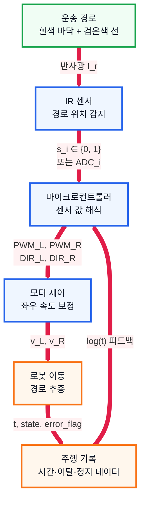
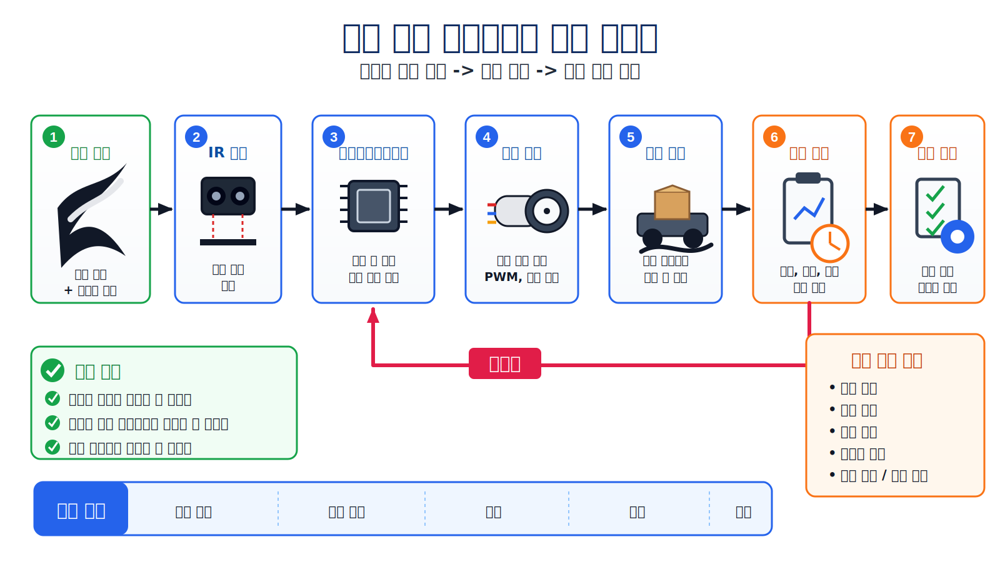

# 1. 문제 정의 및 요구 사항

## 1. 수행 목표

공정 간 부품과 준비 제품을 운송하는 작업을 자동화하기 위해, 검은색 경로를 따라 이동하는 로봇 운반차 프로토타입의 요구 사항을 정의한다.

이번 단계의 핵심은 완성형 산업용 로봇 개발이 아니라 **경로 인식, 경로 추종, 주행 기록 수집 가능성**을 검증하는 것이다.

---

## 2. 문제 요약

| 구분 | 내용 |
| --- | --- |
| 대상 | 소형 로봇 운반차 프로토타입 |
| 환경 | 흰색 바닥, 검은색 운송 경로 |
| 목표 | 검은색 선을 인식하고 따라 이동 |
| 기록 | 주행 시간, 경로 이탈, 정지 여부 등 저장 |
| 범위 | 실제 현장 투입용 완성품 개발은 제외 |

---

## 3. 전체 동작 구조

---

## 4. 주요 요구 사항

| 영역 | 요구 사항 |
| --- | --- |
| 경로 인식 | 흰색 바닥과 검은색 선을 구분해야 한다. |
| 경로 추종 | 직선과 곡선 구간에서 선을 따라 이동해야 한다. |
| 운송 기능 | 소형 부품 또는 준비 제품을 적재할 수 있어야 한다. |
| 데이터 기록 | 주행 시간, 이동 상태, 경로 이탈, 정지 여부를 기록해야 한다. |
| 안전 | 경로 이탈이나 이상 상태 발생 시 정지할 수 있어야 한다. |
| 반복 시험 | 여러 번 실험할 수 있도록 간단히 운용 가능해야 한다. |

---

## 5. 가정 사항

| 항목 | 가정 |
| --- | --- |
| 주행 장소 | 실내 시험 공간 |
| 바닥 | 흰색 |
| 경로 | 검은색 선 |
| 로봇 형태 | 바퀴 기반 소형 이동 로봇 |
| 운송 대상 | 소형 부품 또는 준비 제품 |
| 주행 방식 | 라인 트레이싱 |
| 평가 목적 | 실제 도입 전 기능 검증 |

---

## 6. 최소 기능

| 번호 | 기능 | 설명 |
| --- | --- | --- |
| 1 | 경로 인식 | 센서로 검은색 선을 감지 |
| 2 | 이동 제어 | 좌우 모터 속도 조절로 경로 추종 |
| 3 | 운반 | 소형 적재 공간 확보 |
| 4 | 기록 | 주행 결과 데이터를 저장 |
| 5 | 평가 | 이동 성공 여부와 개선점 확인 |

---

## 7. 결론

로봇 운반차 프로토타입은 다음 세 가지를 검증하면 된다.

1. 검은색 운송 경로를 인식할 수 있는가
2. 경로를 따라 안정적으로 이동할 수 있는가
3. 주행 결과를 평가할 수 있는 데이터를 기록할 수 있는가

따라서 이후 단계에서는 모터, 바퀴, 센서, 엔코더, 차동 구동, PID 제어, 마이크로컨트롤러를 순서대로 검토한다.

---

## 8. 전체 요약

위 흐름도는 문제 정의 단계에서 요구한 핵심 기능을 한 장으로 정리한 것이다. 로봇 운반차는 검은색 경로를 인식하고, 센서 값을 바탕으로 좌우 모터를 제어하며, 주행 결과를 기록해 기능 검증과 개선에 활용한다.
