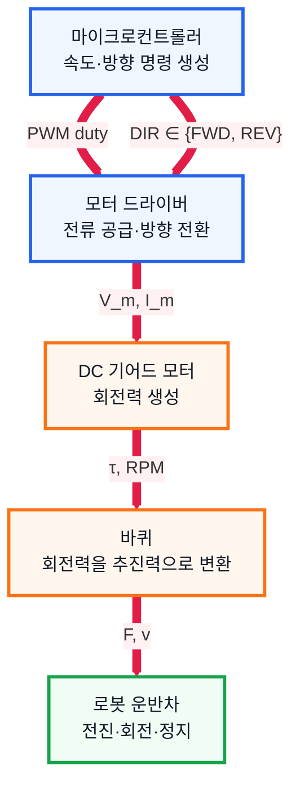
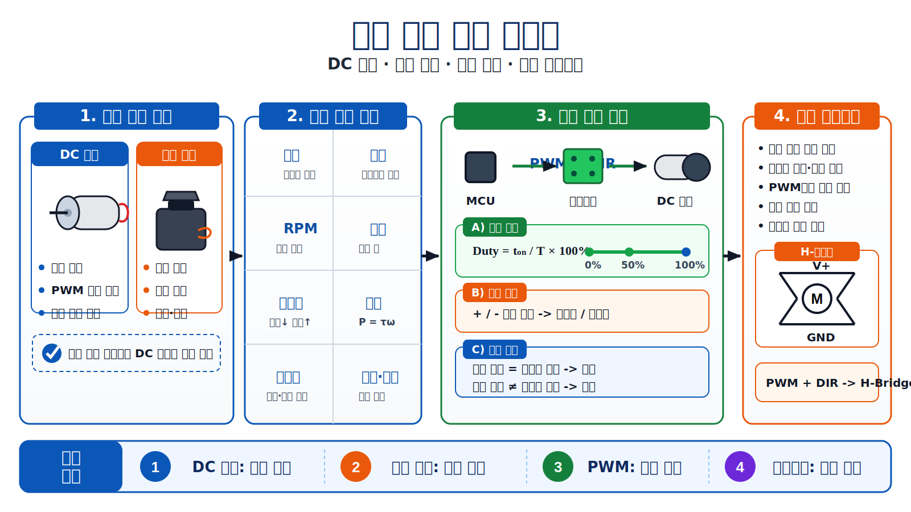

# 2. 모터 조사 문서

## 1. 수행 목표

로봇 운반차의 이동을 담당하는 모터의 종류와 선택 기준을 정리한다.

---

## 2. 모터의 역할

| 역할 | 설명 |
| --- | --- |
| 이동 | 바퀴를 회전시켜 로봇을 전진시킴 |
| 방향 전환 | 좌우 바퀴 속도 차이로 회전 |
| 속도 제어 | PWM으로 회전 속도 조절 |
| 정지 | 모터 출력을 줄이거나 차단 |
| 운반 보조 | 적재물을 싣고도 이동할 힘 제공 |

---

## 3. 모터 종류 비교

| 구분 | DC 모터 | 서보 모터 |
| --- | --- | --- |
| 주요 목적 | 연속 회전 | 각도·위치 제어 |
| 제어 방식 | 전압, PWM, 방향 핀 | 목표 각도 입력 |
| 장점 | 단순하고 저렴함 | 정밀한 위치 제어 가능 |
| 단점 | 위치 제어에는 별도 센서 필요 | 가격이 높고 구조가 복잡함 |
| 적합 용도 | 바퀴 구동 | 조향, 집게, 팔 |

로봇 운반차의 바퀴 구동에는 **DC 기어드 모터**가 가장 적합하다.

---

## 4. 모터 제어 구조

PWM 듀티비는 다음과 같이 표현한다.

$$
\text{Duty} = \frac{t_{\text{on}}}{T} \times 100\%
$$

---

## 5. 모터 선택 기준

| 항목 | 확인 이유 |
| --- | --- |
| 정격 전압 | 배터리 전압과 맞아야 함 |
| 정격 전류 | 모터 드라이버 허용 전류보다 작아야 함 |
| RPM | 로봇 주행 속도 결정 |
| 토크 | 로봇 무게와 적재물을 움직일 힘 |
| 감속비 | 속도는 줄이고 토크는 키움 |
| 엔코더 유무 | 이동 거리와 속도 측정 가능 여부 |
| 크기·무게 | 로봇 구조와 배터리 소모에 영향 |

---

## 6. PWM 속도 제어

PWM은 전원을 빠르게 켜고 끄면서 평균 출력을 조절하는 방식이다.

| 듀티비 | 모터 동작 |
| --- | --- |
| 0% | 정지 |
| 30% | 느린 회전 |
| 60% | 중간 속도 |
| 100% | 최대 속도 |

---

## 7. 결론

프로토타입 로봇 운반차에는 좌우 바퀴를 각각 제어할 수 있도록 **DC 기어드 모터 2개 + 모터 드라이버** 구성이 적합하다.

엔코더가 포함된 모터를 사용하면 주행 거리와 속도 기록까지 가능하므로 이후 평가에 유리하다.

---

## 8. 전체 요약

위 흐름도는 모터 조사 단계의 핵심 내용을 정리한 것이다. 운반 로봇의 바퀴 구동에는 DC 기어드 모터가 적합하며, 속도는 PWM으로 조절하고 방향은 모터 드라이버를 통해 제어한다.

