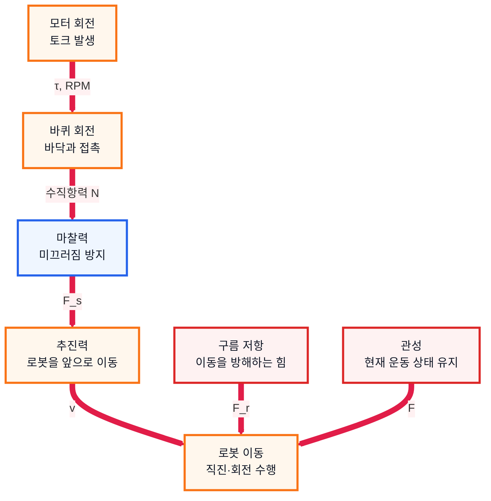

# 3. 바퀴 조사 문서

## 1. 수행 목표

로봇 운반차의 이동 안정성에 영향을 주는 바퀴의 역할, 재질, 마찰, 구름 저항을 정리한다.

---

## 2. 바퀴의 역할

| 역할 | 설명 |
| --- | --- |
| 하중 지지 | 로봇 본체와 적재물을 지탱 |
| 추진력 생성 | 바닥과의 마찰로 이동 |
| 방향 전환 | 좌우 바퀴 속도 차이로 회전 |
| 안정성 확보 | 미끄러짐과 흔들림 감소 |
| 에너지 효율 | 구름 저항에 따라 배터리 소모 변화 |

---

## 3. 바퀴 재질 비교

| 재질 | 장점 | 단점 | 적합성 |
| --- | --- | --- | --- |
| 고무 | 접지력 좋음, 미끄러짐 적음 | 마모 가능 | 높음 |
| 우레탄 | 내구성 좋음, 소음 적음 | 가격 높을 수 있음 | 높음 |
| 플라스틱 | 가볍고 저렴함 | 미끄러지기 쉬움 | 낮음 |
| 금속 | 강도 높음 | 소음, 바닥 손상, 미끄러짐 | 낮음 |

로봇 운반차에는 **고무 또는 우레탄 바퀴**가 적합하다.

---

## 4. 바퀴와 힘의 관계

바퀴에 작용하는 힘은 다음 수식으로 정리할 수 있다.

$$
F_s \le \mu_s N
$$

$$
F_r = C_{rr}N
$$

$$
F = ma
$$

$$
v = \frac{\Delta x}{\Delta t}
$$

---

## 5. 핵심 개념

| 개념 | 의미 | 로봇에 미치는 영향 |
| --- | --- | --- |
| 마찰력 | 바퀴와 바닥 사이의 접지력 | 부족하면 미끄러짐 |
| 정지 마찰 | 미끄러지기 전 작용하는 마찰 | 안정적 출발과 회전에 필요 |
| 동적 마찰 | 미끄러지는 중 작용하는 마찰 | 경로 추종 성능 저하 |
| 관성 | 현재 운동 상태를 유지하려는 성질 | 급출발·급정지 시 불안정 |
| 구름 저항 | 바퀴가 굴러갈 때 생기는 저항 | 모터 부하와 배터리 소모 증가 |

---

## 6. 바퀴 선택 조건

| 조건 | 이유 |
| --- | --- |
| 적절한 지름 | 너무 작으면 요철에 약하고, 너무 크면 제어가 어려움 |
| 적절한 폭 | 너무 좁으면 접지력 부족, 너무 넓으면 저항 증가 |
| 안정적 축 결합 | 바퀴가 헛돌거나 빠지면 안 됨 |
| 충분한 강도 | 적재물을 실어도 변형이 적어야 함 |
| 낮은 구름 저항 | 배터리 소모와 모터 부하 감소 |

---

## 7. 결론

로봇 운반차의 바퀴는 단순한 부품이 아니라 이동 안정성과 경로 추종 성능을 결정하는 핵심 요소이다.

프로토타입에는 접지력과 내구성이 좋은 고무 또는 우레탄 바퀴를 사용하고, 바퀴 크기와 폭은 로봇 무게와 주행 환경에 맞게 선택해야 한다.

