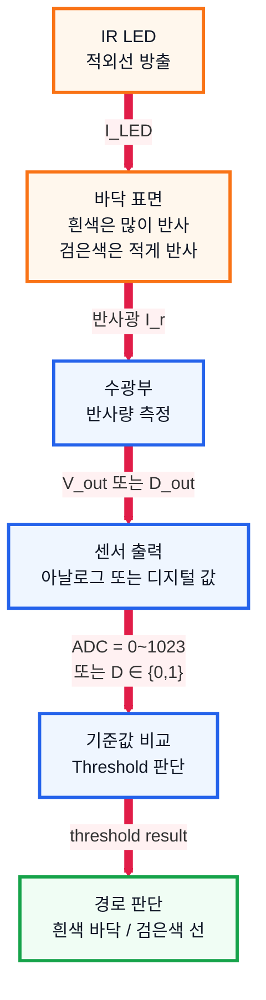

# 4. 센서 및 IR 센서 조사 문서

## 1. 수행 목표

로봇 운반차가 검은색 경로를 인식하기 위해 필요한 센서의 개념과 IR 센서의 동작 원리를 정리한다.

---

## 2. 센서의 역할

| 역할 | 설명 |
| --- | --- |
| 환경 감지 | 바닥 색상, 거리, 위치 등 측정 |
| 상태 확인 | 로봇이 경로 위에 있는지 판단 |
| 제어 입력 | 마이크로컨트롤러에 판단 기준 제공 |
| 데이터 수집 | 주행 평가에 필요한 값 저장 |

---

## 3. 주요 센서 비교

| 센서 | 감지 대상 | 사용 목적 |
| --- | --- | --- |
| IR 센서 | 적외선 반사량 | 검은색 선 감지 |
| 초음파 센서 | 거리 | 장애물 감지 |
| 엔코더 | 회전량 | 이동 거리·속도 측정 |
| 자이로 센서 | 각속도 | 방향 변화 감지 |
| 가속도 센서 | 가속도 | 기울기·충격 감지 |

---

## 4. IR 센서 동작 원리

센서 판단 기준은 다음과 같이 표현할 수 있다.

$$
s =
\begin{cases}
1, & V_{\text{out}} > V_{\text{th}} \\
0, & V_{\text{out}} \le V_{\text{th}}
\end{cases}
$$

흰색 바닥은 적외선을 많이 반사하고, 검은색 선은 적게 반사한다.

| 바닥 상태 | 반사량 | 센서 해석 |
| --- | --- | --- |
| 흰색 바닥 | 많음 | 경로 밖 |
| 검은색 선 | 적음 | 경로 위 |

---

## 5. 센서 신호

| 신호 종류 | 설명 | 특징 |
| --- | --- | --- |
| 아날로그 | 연속적인 전압 값 | 세밀한 측정 가능 |
| 디지털 | 0 또는 1 | 처리 쉽고 빠름 |

아날로그 센서는 ADC를 통해 숫자로 변환한 뒤 기준값과 비교한다.

---

## 6. 배치와 보정

| 항목 | 주의점 |
| --- | --- |
| 센서 높이 | 너무 높으면 반사량 약함, 너무 낮으면 범위 좁음 |
| 센서 간격 | 검은색 선 폭에 맞게 배치 |
| 센서 개수 | 2개 이상이면 방향 판단 쉬움 |
| 조명 | 외부 빛이 강하면 오작동 가능 |
| 기준값 | 실제 바닥에서 흰색/검은색 값을 측정해 설정 |

---

## 7. 로봇 제어 예시

| 센서 값 | 의미 | 제어 |
| --- | --- | --- |
| 중앙 감지 | 경로 중앙 | 직진 |
| 왼쪽 감지 | 선이 왼쪽 | 왼쪽 보정 |
| 오른쪽 감지 | 선이 오른쪽 | 오른쪽 보정 |
| 모두 흰색 | 선을 놓침 | 감속 또는 탐색 |
| 모두 검은색 | 교차로·정지선 가능 | 정지 또는 판단 |

---

## 8. 결론

IR 센서는 구조가 단순하고 응답이 빨라 라인 트레이싱 로봇에 적합하다.

로봇 운반차는 IR 센서로 검은색 경로를 감지하고, 그 결과를 이용해 좌우 모터 속도를 조절한다.

