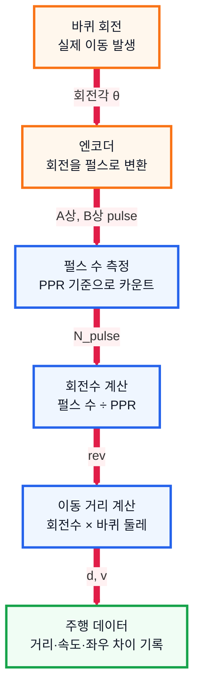

# 5. 엔코더 조사 문서

## 1. 수행 목표

로봇 운반차의 이동 거리와 속도를 측정하기 위해 사용하는 엔코더의 원리와 계산 방법을 정리한다.

---

## 2. 엔코더의 역할

| 역할 | 설명 |
| --- | --- |
| 회전량 측정 | 모터 축 또는 바퀴 회전수를 측정 |
| 거리 계산 | 회전수와 바퀴 둘레로 이동 거리 계산 |
| 속도 계산 | 일정 시간 동안의 이동 거리 계산 |
| 좌우 비교 | 양쪽 바퀴 회전 차이 확인 |
| 주행 기록 | 실제 주행 데이터 저장 |

---

## 3. 엔코더 동작 구조

엔코더 계산식은 다음과 같다.

$$
\text{rev} = \frac{N_{\text{pulse}}}{PPR}
$$

$$
C = \pi D
$$

$$
d = \text{rev} \times C
$$

$$
v = \frac{d}{\Delta t}
$$

---

## 4. 엔코더 종류

| 종류 | 원리 | 특징 |
| --- | --- | --- |
| 광학식 | 빛의 통과/차단 감지 | 정밀하지만 먼지에 약할 수 있음 |
| 자기식 | 자석과 홀 센서 사용 | 소형 로봇에 많이 사용, 외부 빛 영향 적음 |

---

## 5. 핵심 용어

| 용어 | 의미 |
| --- | --- |
| 펄스 | 엔코더가 회전을 감지할 때 출력하는 신호 |
| PPR | 1회전당 발생하는 펄스 수 |
| A상/B상 | 회전 방향까지 알기 위한 두 개의 펄스 신호 |

PPR이 클수록 작은 회전 변화도 더 세밀하게 측정할 수 있다.

---

## 6. 거리와 속도 계산

$$
\text{회전수} = \frac{\text{측정 펄스 수}}{PPR}
$$

$$
\text{바퀴 둘레} = \pi \times \text{바퀴 지름}
$$

$$
\text{이동 거리} = \text{회전수} \times \text{바퀴 둘레}
$$

$$
\text{속도} = \frac{\text{이동 거리}}{\text{시간}}
$$

예시:

| 조건 | 값 |
| --- | --- |
| 바퀴 지름 | 6cm |
| 바퀴 둘레 | 18.84cm |
| 엔코더 해상도 | 100 PPR |
| 측정 펄스 | 500개 |

$$
\text{회전수} = \frac{500}{100} = 5
$$

$$
\text{이동 거리} = 5 \times 18.84 = 94.2\text{ cm}
$$

---

## 7. 오차 원인과 보정

| 오차 원인 | 설명 | 보정 방법 |
| --- | --- | --- |
| 바퀴 미끄러짐 | 회전했지만 실제 이동은 적음 | 급출발·급정지 줄이기 |
| 바퀴 지름 오차 | 실제 지름과 계산값 차이 | 실제 둘레 측정 |
| 바닥 상태 | 먼지, 요철, 마찰 변화 | 반복 실험 |
| 좌우 모터 차이 | 같은 명령에도 속도 차이 | 좌우 엔코더 비교 |
| 펄스 누락 | 빠른 회전 또는 노이즈 | 필터링 적용 |

---

## 8. 결론

엔코더는 로봇이 실제로 얼마나 이동했는지 확인하는 핵심 센서이다.

IR 센서가 경로를 인식한다면, 엔코더는 이동 거리와 속도를 기록해 주행 결과를 평가하는 역할을 한다.

