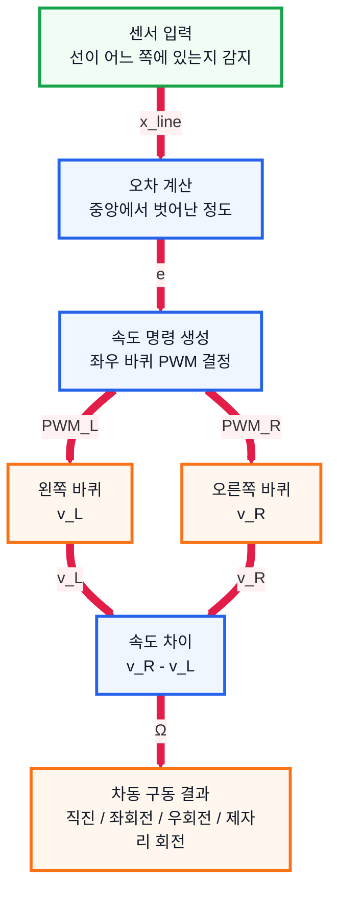

# 6. 차동 구동 방식 조사 문서

## 1. 수행 목표

좌우 두 바퀴의 속도 차이를 이용해 로봇의 방향을 바꾸는 차동 구동 방식을 정리한다.

---

## 2. 차동 구동 개념

차동 구동은 왼쪽 바퀴와 오른쪽 바퀴를 독립적으로 제어해 직진, 회전, 제자리 회전을 수행하는 방식이다.

| 왼쪽 바퀴 | 오른쪽 바퀴 | 로봇 동작 |
| --- | --- | --- |
| 같은 속도 | 같은 속도 | 직진 |
| 느림 | 빠름 | 왼쪽 회전 |
| 빠름 | 느림 | 오른쪽 회전 |
| 정방향 | 역방향 | 제자리 회전 |
| 정지 | 정지 | 정지 |

---

## 3. 구동 구조

차동 구동의 기본 수식은 다음과 같다.

$$
e = x_{\text{ref}} - x_{\text{line}}
$$

$$
v_L = r\omega_L
$$

$$
v_R = r\omega_R
$$

$$
\Omega = \frac{v_R - v_L}{L}
$$

---

## 4. 기본 변수

| 기호 | 의미 |
| --- | --- |
| `r` | 바퀴 반지름 |
| `L` | 좌우 바퀴 사이 거리 |
| `ω_L` | 왼쪽 바퀴 각속도 |
| `ω_R` | 오른쪽 바퀴 각속도 |
| `v_L` | 왼쪽 바퀴 선속도 |
| `v_R` | 오른쪽 바퀴 선속도 |
| `v` | 로봇 중심 속도 |
| `Ω` | 로봇 회전 각속도 |

---

## 5. 핵심 계산식

$$
v_L = r\omega_L
$$

$$
v_R = r\omega_R
$$

$$
v = \frac{v_R + v_L}{2}
$$

$$
\Omega = \frac{v_R - v_L}{L}
$$

| 조건 | 의미 |
| --- | --- |
| `v_R = v_L` | 직진 |
| `v_R > v_L` | 왼쪽 회전 |
| `v_R < v_L` | 오른쪽 회전 |
| `v_R = -v_L` | 제자리 회전 |

---

## 6. 회전 반경

$$
R = \frac{v}{\Omega}
$$

| 좌우 속도 차이 | 회전 반경 | 동작 |
| --- | --- | --- |
| 없음 | 무한대 | 직진 |
| 작음 | 큼 | 완만한 회전 |
| 큼 | 작음 | 급회전 |
| 반대 방향 | 0 | 제자리 회전 |

---

## 7. 로봇 운반차 적용

| 상황 | 제어 방법 |
| --- | --- |
| 선 중앙 | 좌우 바퀴 속도 동일 |
| 선이 왼쪽 | 왼쪽으로 보정 |
| 선이 오른쪽 | 오른쪽으로 보정 |
| 급회전 필요 | 좌우 속도 차이 증가 |
| 방향만 변경 | 제자리 회전 |

---

## 8. 결론

차동 구동 방식은 구조가 단순하고 제어가 쉬워 소형 로봇 운반차에 적합하다.

IR 센서로 경로 위치를 판단하고, 좌우 바퀴 속도 차이를 조절하면 검은색 선을 따라 이동할 수 있다.

