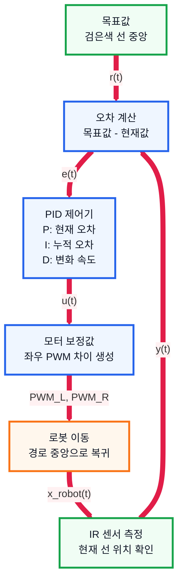

# 7. 피드백 제어 및 PID 제어 조사 문서

## 1. 수행 목표

로봇이 검은색 경로를 안정적으로 따라가도록 하는 피드백 제어와 PID 제어의 개념을 정리한다.

---

## 2. 제어 시스템 구성

| 구성 | 의미 | 로봇 예시 |
| --- | --- | --- |
| 목표값 | 원하는 상태 | 선 중앙, 목표 속도 |
| 현재값 | 센서로 측정한 상태 | 현재 선 위치, 현재 속도 |
| 오차 | 목표값과 현재값 차이 | 중앙에서 벗어난 정도 |
| 제어기 | 오차로 보정값 계산 | PID |
| 구동기 | 명령을 실제 동작으로 변환 | 모터, 모터 드라이버 |

$$
\text{오차} = \text{목표값} - \text{현재값}
$$

---

## 3. 피드백 제어 구조

PID 제어에서 사용하는 수식은 다음과 같다.

$$
e(t) = r(t) - y(t)
$$

$$
u(t) = K_p e(t) + K_i \int e(t)\,dt + K_d \frac{de(t)}{dt}
$$

$$
PWM_L = base - u(t)
$$

$$
PWM_R = base + u(t)
$$

피드백 제어는 센서로 실제 상태를 계속 확인하고, 오차가 있으면 다시 보정하는 방식이다.

---

## 4. 오픈 루프와 클로즈드 루프

| 구분 | 오픈 루프 | 클로즈드 루프 |
| --- | --- | --- |
| 센서 피드백 | 사용 안 함 | 사용함 |
| 장점 | 단순함 | 오차 보정 가능 |
| 단점 | 실제 결과를 모름 | 구현과 튜닝 필요 |
| 예시 | PWM 50%로 계속 전진 | IR 센서로 선 위치 확인 후 보정 |

라인 트레이싱 로봇은 클로즈드 루프 제어에 해당한다.

---

## 5. PID 제어

PID 제어는 P, I, D 세 항을 합쳐 제어 출력값을 만든다.

| 항목 | 역할 | 효과 |
| --- | --- | --- |
| P | 현재 오차에 비례 | 빠른 반응 |
| I | 누적 오차 반영 | 한쪽으로 치우치는 오차 보정 |
| D | 오차 변화 속도 반영 | 흔들림과 오버슈트 감소 |

$$
\text{출력}
= K_p \times \text{오차}
+ K_i \times \text{누적오차}
+ K_d \times \text{오차변화율}
$$

---

## 6. 라인 트레이싱 적용

PID 출력값은 좌우 모터 속도 차이로 사용한다.

$$
PWM_L = base\_speed - \text{보정값}
$$

$$
PWM_R = base\_speed + \text{보정값}
$$

센서 배치와 오차 부호에 따라 +, - 방향은 달라질 수 있으므로 실제 테스트로 확인해야 한다.

---

## 7. 튜닝 방법

| 단계 | 방법 | 목적 |
| --- | --- | --- |
| 1 | `Ki = 0`, `Kd = 0`으로 두고 `Kp` 조절 | 반응 속도 확보 |
| 2 | 흔들림이 크면 `Kd` 추가 | 진동 감소 |
| 3 | 한쪽으로 계속 치우치면 `Ki` 추가 | 누적 오차 보정 |

---

## 8. 튜닝 현상 정리

| 현상 | 원인 | 조정 |
| --- | --- | --- |
| 반응이 느림 | Kp 작음 | Kp 증가 |
| 심하게 흔들림 | Kp 큼 | Kp 감소 또는 Kd 증가 |
| 목표를 지나침 | Kd 부족 | Kd 증가 |
| 한쪽으로 치우침 | Ki 부족 | Ki 조금 증가 |
| 출력이 불안정 | Kd 큼 또는 노이즈 | Kd 감소, 필터링 |

---

## 9. 결론

PID 제어는 로봇이 경로에서 벗어났을 때 다시 중앙으로 돌아오도록 만드는 핵심 제어 방식이다.

IR 센서로 오차를 계산하고, PID 출력으로 좌우 모터 속도를 조절하면 안정적인 경로 추종이 가능하다.

