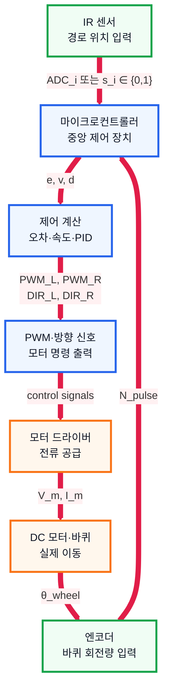

# 8. 마이크로컨트롤러 조사 문서

## 1. 수행 목표

로봇 운반차의 센서 입력, 제어 계산, 모터 출력을 담당하는 마이크로컨트롤러의 역할을 정리한다.

---

## 2. 마이크로컨트롤러의 역할

| 역할 | 설명 |
| --- | --- |
| 센서 입력 | IR 센서, 엔코더 값을 읽음 |
| 제어 계산 | 오차 계산, PID 계산 수행 |
| 모터 출력 | PWM과 방향 신호 출력 |
| 통신 | PC 또는 모듈과 데이터 송수신 |
| 기록 | 주행 시간과 센서 데이터를 저장 또는 전송 |

마이크로컨트롤러는 로봇의 두뇌 역할을 한다.

---

## 3. 전체 제어 흐름

---

## 4. 입출력 방식

| 방식 | 용도 | 예시 |
| --- | --- | --- |
| 디지털 입력/출력 | 0 또는 1 처리 | 버튼, 방향 제어 |
| 아날로그 입력 | 연속 전압 읽기 | IR 센서, 배터리 전압 |
| PWM 출력 | 평균 출력 조절 | 모터 속도 제어 |

PWM은 듀티비가 클수록 모터가 더 빠르게 회전한다.

---

## 5. 통신 방식

| 방식 | 특징 | 사용 예 |
| --- | --- | --- |
| UART | 단순한 1:1 직렬 통신 | PC 시리얼 모니터, 블루투스 |
| I2C | 적은 선으로 여러 장치 연결 | OLED, IMU 센서 |
| SPI | 빠른 통신 가능 | SD 카드, 디스플레이 |

---

## 6. 타이머와 실시간 제어

로봇은 일정한 시간 간격으로 센서를 읽고 모터 출력을 갱신해야 한다.

1. IR 센서 값 읽기
2. 엔코더 값 읽기
3. 오차 계산
4. PID 계산
5. 모터 PWM 출력
6. 주행 데이터 기록

예를 들어 10ms마다 반복하면 1초에 100번 제어가 수행된다.

---

## 7. 아두이노 적용

| 보드 | 특징 |
| --- | --- |
| Arduino Uno | 입문용, 자료 많음 |
| Arduino Nano | 작고 가벼워 소형 로봇에 적합 |
| ESP32 | Wi-Fi, Bluetooth 내장 |
| STM32 | 성능 높음, 고급 제어 학습에 적합 |

프로토타입에는 Arduino Uno 또는 Nano가 적합하다.

---

## 8. 결론

마이크로컨트롤러는 센서 값을 읽고, 제어 알고리즘을 실행하며, 모터 드라이버에 PWM과 방향 신호를 출력한다.

따라서 로봇 운반차의 경로 추종과 주행 기록 기능을 구현하는 중심 장치이다.

