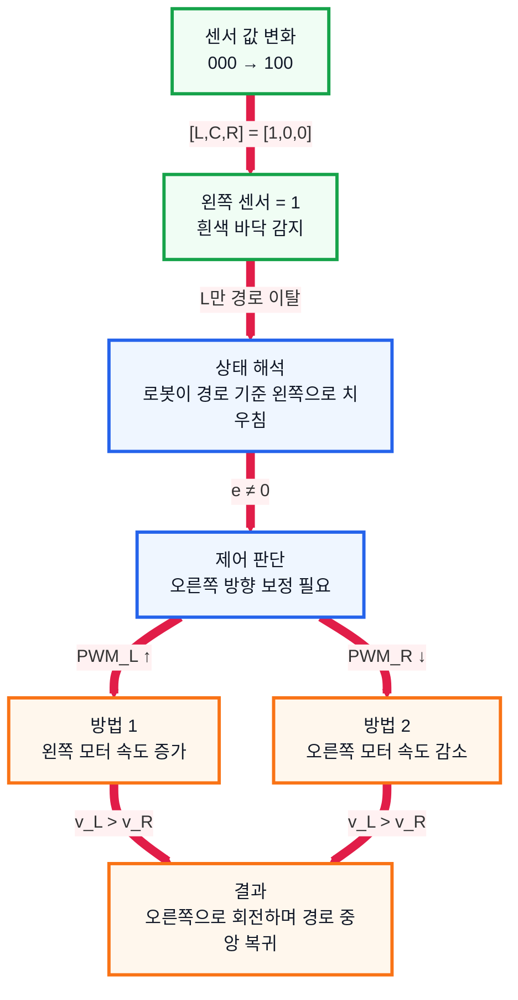

# 9. 운반 로봇 제어 상황 분석

## 1. 수행 목표

주어진 로봇 스펙, IR 센서 값, 엔코더 데이터를 이용해 로봇의 제어 방향과 이동 결과를 분석한다.

---

## 2. 주어진 조건

| 항목 | 값 |
| --- | ---: |
| 바퀴 지름 | 10cm |
| 바퀴 반지름 | 5cm |
| 엔코더 해상도 | 1회전당 30펄스 |
| 두 바퀴 사이 거리 | 20cm |
| IR 센서 개수 | 3개 |
| 흰색 바닥 | 1 |
| 검은색 경로 | 0 |

센서는 `[왼쪽, 중앙, 오른쪽]` 순서로 해석한다.

---

## 3. 센서 값 해석

| 구분 | 센서 값 |
| --- | --- |
| 기존 센서 값 | `000` |
| 변경 센서 값 | `100` |

| 센서 값 | 의미 | 판단 |
| --- | --- | --- |
| `000` | 세 센서 모두 검은색 감지 | 경로 위 안정 주행 |
| `100` | 왼쪽 센서만 흰색 감지 | 로봇이 왼쪽으로 치우침 |

따라서 `100` 상태에서는 로봇이 경로 중앙으로 돌아가기 위해 **오른쪽으로 보정**해야 한다.

---

## 4. 제어 판단 흐름

오른쪽 보정 조건은 다음처럼 정리할 수 있다.

$$
[L, C, R] = [1, 0, 0]
$$

$$
e \ne 0
$$

$$
v_L > v_R \Rightarrow \text{오른쪽 회전}
$$

---

## 5. 1펄스당 이동 거리

$$
C = \pi D = 10\pi\text{ cm}
$$

$$
d_{\text{pulse}} = \frac{10\pi}{30}
                 = \frac{\pi}{3}\text{ cm}
$$

$$
d_{\text{pulse}} \approx 1.047\text{ cm}
$$

---

## 6. 구간별 이동 분석

| 구간 | 엔코더 값 | 동작 | 계산 결과 |
| --- | --- | --- | ---: |
| 1구간 | 좌우 100펄스 | 직진 | 약 104.72cm |
| 2구간 | 왼쪽 20펄스, 오른쪽 10펄스 | 오른쪽 회전 | 중심 이동 약 15.71cm |
| 3구간 | 좌우 50펄스 | 회전 후 직진 | 약 52.36cm |

---

## 7. 회전 구간 계산

2구간에서 각 바퀴 이동 거리는 다음과 같다.

$$
d_L = 20 \times \frac{\pi}{3}
    = \frac{20\pi}{3}\text{ cm}
    \approx 20.94\text{ cm}
$$

$$
d_R = 10 \times \frac{\pi}{3}
    = \frac{10\pi}{3}\text{ cm}
    \approx 10.47\text{ cm}
$$

왼쪽 바퀴가 더 많이 이동했으므로 로봇은 오른쪽으로 회전한다.

$$
\theta = \frac{d_R - d_L}{L}
       = \frac{\frac{10\pi}{3} - \frac{20\pi}{3}}{20}
       = -\frac{\pi}{6}\text{ rad}
       = -30^\circ
$$

음수는 오른쪽 회전으로 해석한다.

---

## 8. 회전 반경과 전체 거리

$$
d_c = \frac{d_L + d_R}{2}
    = \frac{\frac{20\pi}{3} + \frac{10\pi}{3}}{2}
    = 5\pi\text{ cm}
    \approx 15.71\text{ cm}
$$

$$
R = \frac{d_c}{|\theta|}
  = \frac{5\pi}{\frac{\pi}{6}}
  = 30\text{ cm}
$$

전체 중심 이동 거리는 다음과 같다.

$$
d_{\text{total}} = 104.72 + 15.71 + 52.36
                 \approx 172.79\text{ cm}
$$

---

## 9. 최종 정리

| 항목 | 결과 |
| --- | ---: |
| 1펄스당 이동 거리 | 약 1.047cm |
| 첫 번째 직진 거리 | 약 104.72cm |
| 회전 각도 | 오른쪽 30° |
| 회전 반경 | 약 30cm |
| 마지막 직진 거리 | 약 52.36cm |
| 전체 주행 거리 | 약 172.79cm |

로봇의 전체 이동은 다음과 같이 해석된다.

`직진` -> `오른쪽으로 30도 회전` -> `회전한 방향으로 직진`

센서 값 `100`에 대해서는 오른쪽 보정을 수행해야 하며, 차동 구동에서는 왼쪽 모터를 더 빠르게 하거나 오른쪽 모터를 느리게 하면 된다.

